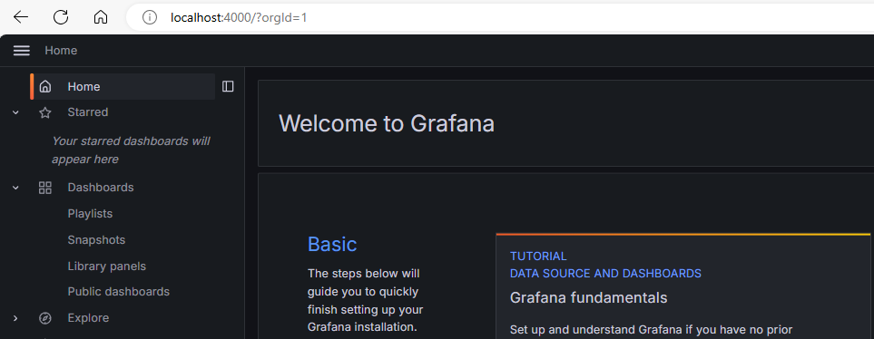
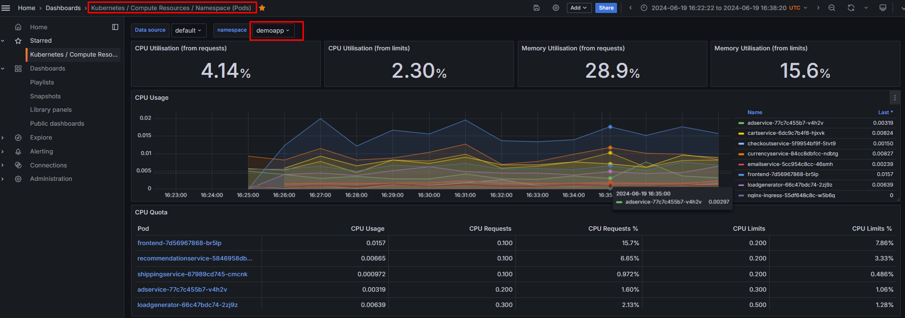

# MicroServices Deployment Sample


### [View all Roadmaps](https://github.com/nholuongut/all-roadmaps) &nbsp;&middot;&nbsp; [Best Practices](https://github.com/nholuongut/all-roadmaps/blob/main/public/best-practices/) &nbsp;&middot;&nbsp; [Questions](https://www.linkedin.com/in/nholuong/)
<br/>

Sample microservices deployment on k8s with reverse proxy, monitoring, logging features...

## Introduction

In this project you'll use following tools and applications:

- K8s
- Helm
- Prometheus + Grafana
- Nginx
- 10+ microservices

Now let's start the journey!

## 1. Deploy the namespace

```bash
# monitor
kubectl create ns monitoring
# app
kubectl create ns demoapp

# Check namespaces
kubectl get ns
```

## 2. Deploy the application

In this project we use the sample microservices application from [nholuongut/microservices-demo-sample](https://github.com/nholuongut/microservices-demo-sample)

```bash
kubectl apply -f https://raw.githubusercontent.com/nholuongut/microservices-demo-sample/main/release/kubernetes-manifests.yaml -n demoapp
# To debug, run: kubectl get services -n  demoapp
```

## 3. Deploy Nginx proxy

Deploy the Nginx proxy prior to `fontend` service, using [manifest/nginx](./manifest/nginx/nginx.yaml)

```bash
kubectl apply -f manifest/nginx/nginx.yaml -n demoapp
# To debug, run: kubectl get services -n  demoapp
```

## 4. Expose Nginx service

Open another terminal and run:

```bash
# Note: You can also replace 8090 to the working PORT in your PC
kubectl port-forward service/nginx-ingress -n demoapp 8090:80
```

Now visit http://localhost:8090/ to access your application locally:


## 5. Prometheus + Grafana

In section #4 we've successfully deploy our microservices application on k8s, deploy the Nginx proxy infont of the fontend app. Now let's monitor our application with Prometheus + Grafana

### 5.1. Deploy Prometheus/Grafana stack

<!--  -->

- We will use Helm to deploy the Prometheus stack from `prometheus-community`:

```bash
# Prepare
helm repo add prometheus-community https://prometheus-community.github.io/helm-charts
helm repo update
# Deploy
helm install kube-prometheus-stack prometheus-community/kube-prometheus-stack --namespace monitoring
```

- Verify installation

```bash
# Pod checking
kubectl --namespace monitoring get pods -l "release=kube-prometheus-stack"
# All resources checking
kubectl --namespace monitoring get all
```

### 5.2. Access the dashboard

- Expose Grafana

```bash
kubectl port-forward svc/kube-prometheus-stack-grafana -n monitoring 4000:80
```

- Expose Prometheus

```bash
kubectl port-forward svc/kube-prometheus-stack-prometheus -n monitoring 4001:9090
```

- Now we can login to http://localhost:4000 (The default username/password for Grafana is `admin/prom-operator`)
  

### 5.3. Explore the Grafana

- Choose your dashboard
  

- Select the namespace
  

- Keep exploring the dashboard your way to see the metrics stats of our application on Kubernetes

## Reference

- https://artifacthub.io
- https://prometheus-community.github.io/helm-charts
- https://helm.sh/docs/
- https://github.com/nholuongut/microservices-demo-sample
- https://nginx.org/en/docs/

# 🚀 I'm are always open to your feedback.  Please contact as bellow information🌟:
### [Contact ]
* [Name: nho Luong]
* [Skype](luongutnho_skype)
* [Github](https://github.com/nholuongut/)
* [Linkedin](https://www.linkedin.com/in/nholuong/)
* [Email Address](luongutnho@hotmail.com)
* If you find this repository helpful, kindly consider showing your appreciation by giving it a star ⭐ Thanks! 💖


[](https://ko-fi.com/nholuong)

# License
* Nho Luong (c). All Rights Reserved.🌟